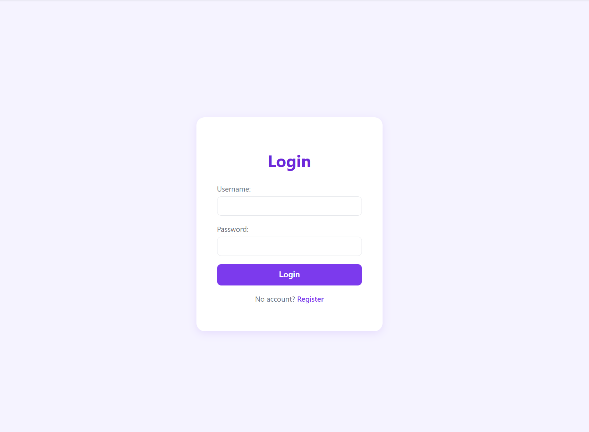
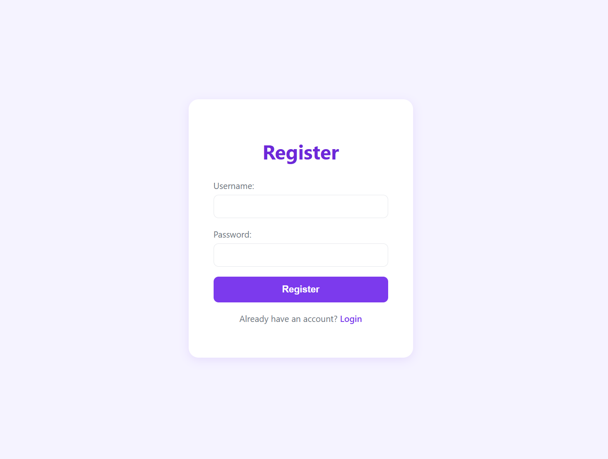
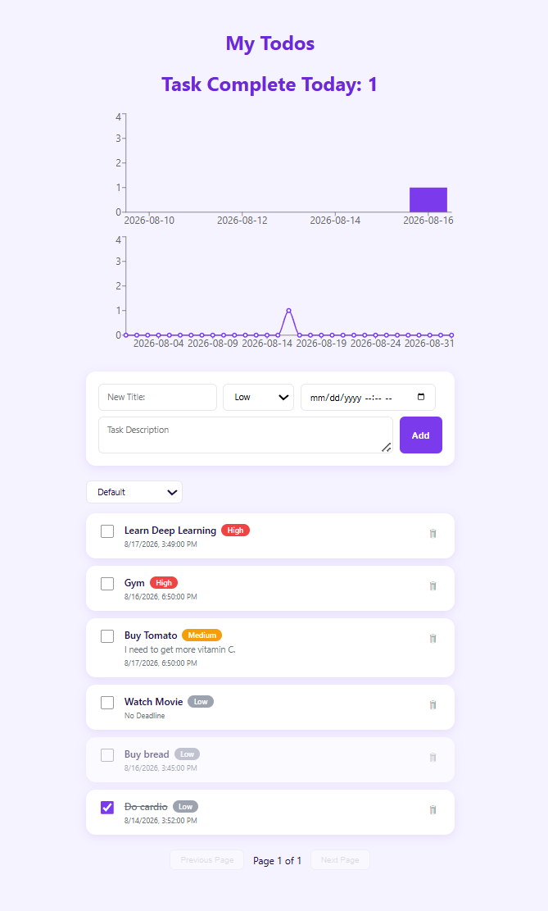

# Todo List Full-Stack App

A full-stack todo list application with separate frontend and backend. Users can register, log in, and manage their own tasks with priority levels, deadlines, an overdue indicator, sortable views, and a completion-stats dashboard.

**Live demo:** [https://todolist-app-fullstack.vercel.app]

## Tech Stack

### Backend

| Technology | Purpose |
|---|---|
| Spring Boot 4.1.0 | Application framework |
| Spring Data JPA / Hibernate | ORM, database access |
| Spring Security | API authorization |
| MySQL (hosted on Aiven) | Database |
| JWT (jjwt) | Stateless auth/session handling |
| BCrypt | Password hashing |
| Lombok | Boilerplate reduction |
| Maven | Dependency and build management |
| Docker | Containerized deployment to Render |

### Frontend

| Technology | Purpose |
|---|---|
| React 18 | UI framework |
| TypeScript | Type system |
| Vite | Build tool and dev server |
| React Router | Client-side routing |
| Recharts | Bar/line charts for the stats dashboard |
| Native fetch | HTTP requests |
| Plain CSS (CSS variables + Flexbox) | Styling, no third-party UI library |

### Deployment

| Layer | Platform |
|---|---|
| Database | Aiven (free-tier MySQL) |
| Backend | Render (free-tier Web Service, deployed via Docker) |
| Frontend | Vercel (static hosting) |

## Features

**Auth**
- Registration (password strength validation, BCrypt hashing)
- Login (JWT issuance, 7-day expiry)
- Persistent login (token in localStorage, survives refresh)
- Route guards (unauthenticated users redirected to login; expired/invalid tokens are cleared automatically)

**Tasks**
- Create, edit (via modal), delete (with confirmation) tasks — title, description, priority, deadline
- Paginated task list, 10 per page
- Toggle complete/incomplete via checkbox; completed tasks automatically sink to the bottom, sorted by completion time (most recent first); active tasks sorted by creation time
- Sort switcher: Default (mixed sort above) / By Create Time / By Priority — sorting always respects the "active before completed" grouping
- Overdue tasks (past deadline, still incomplete) are visually greyed out; editing the deadline clears the overdue state automatically

**Stats dashboard** (top of the task list page)
- Today's completed task count
- Weekly bar chart (Monday–Sunday, current calendar week)
- Monthly line chart (1st to last day of the current calendar month)

## Features Display

> Add screenshots as PNG/JPG files under `docs/images/` in the repo, then reference them below with the same filenames. Recommended shots, in the order a new visitor would see them:

**1. Login page**



**2. Register page**



**2. Task list with stats dashboard** 




## Running Locally

### Prerequisites

- JDK 17
- Node.js (LTS)
- MySQL 8.0+ (local) or an Aiven/other cloud MySQL instance

### 1. Set up the database

```sql
CREATE DATABASE todo_app CHARACTER SET utf8mb4;
```
Create the tables manually per `data-model.md` (`ddl-auto=validate`, so tables are not auto-created).

### 2. Start the backend

```bash
cd todo-backend/demo
```
`application.properties` reads connection info from environment variables with local-friendly defaults, so no changes are needed to run locally:
```properties
spring.datasource.url=${DB_URL:jdbc:mysql://localhost:3306/todo_app?serverTimezone=Asia/Shanghai}
spring.datasource.username=${DB_USERNAME:root}
spring.datasource.password=${DB_PASSWORD:}
jwt.secret=${JWT_SECRET:this-is-a-very-long-secret-key-for-jwt-signing-1234567890}
```
Run:
```bash
./mvnw spring-boot:run
```
Runs on `http://localhost:8080` by default.

### 3. Start the frontend

```bash
cd frontend
npm install
npm run dev
```
Runs on `http://localhost:5173` by default. `src/api/request.ts` points `BASE_URL` at the deployed backend by default — change it back to `http://localhost:8080` for local backend testing.

> CORS allowed origins in `WebSecurityConfig` currently include both `http://localhost:5173` and the deployed Vercel domain.

## Deploying

The current live deployment uses:
1. **Aiven** — free-tier MySQL, tables created manually via the SQL in `data-model.md`
2. **Render** — backend deployed via the `Dockerfile` in `todo-backend/demo` (Render has no native Java runtime, so Docker is required); `DB_URL`, `DB_USERNAME`, `DB_PASSWORD`, `JWT_SECRET` are set as environment variables in the Render dashboard, not committed to the repo
3. **Vercel** — frontend deployed directly from the `frontend` directory, auto-detected as a Vite project
